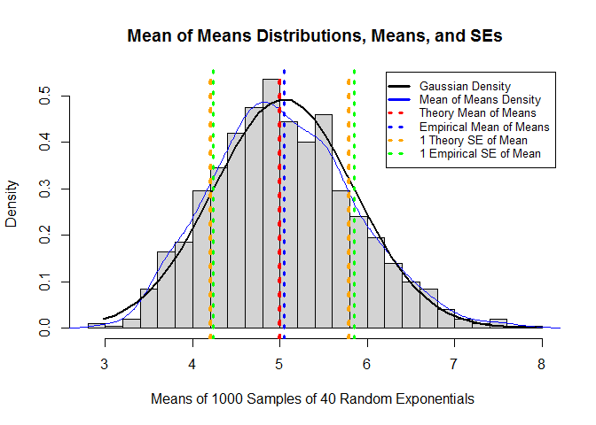
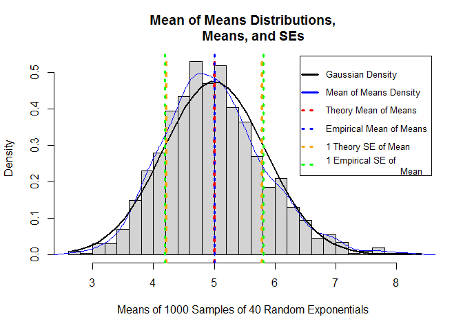

#Example: Validating an R function behaves as expected
#### Author: Russ Robbins

##Summary:

Statistical theory indicates that sample statistics are unbiased estimators of the population parameters they seek to represent. This example shows that the data generated by the R function rexp() indeed, over 40 draws performed 1000 times, does provide data that maps to statistical theory. Thus, this analysis shows, that in at least in the context shown here, the function rexp() acts as expected. Note that if rexp() acts as expected, rexp() can then be used for simulation experiments that use rexp's underlying distribution, if all other constraints are met.

Please refer to the graph below.

The average mean is centered at 5.0365828.
Theory, for this lambda, indicated it would be centered at 5. 

The standard error of the mean is 0.7883693.
Theory, for this lambda, indicated it would be 0.7905694. 

Note that the distribution that was generated approximates the Gaussian distribution, which is what is expected when sample statistics are indeed unbiased estimators.


```
## Installing package into 'C:/Users/Russ/Documents/R/win-library/3.2'
## (as 'lib' is unspecified)
```

```
## package 'plotrix' successfully unpacked and MD5 sums checked
## 
## The downloaded binary packages are in
## 	C:\Users\Russ\AppData\Local\Temp\Rtmp6pnC8M\downloaded_packages
```


 

```
## [1] "#"
```

##Appendix 

Note that the results (as shown in the figures above) differ from since different simulations were run. The code for for the executive summary is hidden (i.e., echo=FALSE).

1. First I set the parameters to be used with rexp().

```r
a_lambda <- 0.2
a_n=40
a_num_sims=1:1000
a_sample_mean<-1/lambda
a_SD<-1/a_lambda
a_exp_mean_of_means <- a_sample_mean
a_exp_SE_of_means <- SD / sqrt(n)
```

2. Then I checked to see that the function rexp() actually creates different distributions each time.

```r
par(mfrow = c(1,3))

set.seed(1020)
a_rexp_sim1<-rexp(a_n,a_lambda)
a_rexp_mean1<-round(mean(a_rexp_sim1),3)
a_rexp_sd1<-round(sd(a_rexp_sim1),3)
a_xname<-paste("Mean: ", a_rexp_mean1," SD: ", a_rexp_sd1)
hist(x=a_rexp_sim1,xlab=a_xname)

set.seed(3888)
a_rexp_sim2<-rexp(a_n,a_lambda)
a_rexp_mean2<-round(mean(a_rexp_sim2),3)
a_rexp_sd2<-round(sd(a_rexp_sim2),3)
a_xname<-paste("Mean: ", a_rexp_mean2," SD: ", a_rexp_sd2)
hist(x=a_rexp_sim2,xlab=a_xname)

set.seed(4242)
a_rexp_sim3<-rexp(a_n,a_lambda)
a_rexp_mean3<-round(mean(a_rexp_sim3),3)
a_rexp_sd3<-round(sd(a_rexp_sim3),3)
a_xname<-paste("Mean: ", a_rexp_mean3," SD: ", a_rexp_sd3)
hist(x=a_rexp_sim3,xlab=a_xname)
```

3. Then I ran 1000 simulations of samples of 40 randomly drawn exponentials and computed the empirical mean as well as the empircal standard error.

```r
a_rexp_sims<-data.frame(lapply(a_num_sims, function (x) {rexp(a_n,a_lambda)}))
colnames(a_rexp_sims)<-a_num_sims
a_rexp_sims_sample_means<-data.frame(sapply(a_rexp_sims,mean))
colnames(a_rexp_sims_sample_means)<-c("means")
a_emp_mean_of_means<-mean(a_rexp_sims_sample_means[,1])
a_emp_SE_of_means<-sd(a_rexp_sims_sample_means[,1])
a_h<-unlist(a_rexp_sims_sample_means[,1])
```

4. Then I created a table and a histogram to show that the theory and the empirical results actually agreed.

```r
statistics<-c(a_exp_mean_of_means,
              a_emp_mean_of_means,
              a_exp_SE_of_means,
              a_emp_SE_of_means)
  
a_t<-matrix(data=c(a_exp_mean_of_means,
                   a_emp_mean_of_means,a_exp_SE_of_means,a_emp_SE_of_means),
            nrow=2, ncol=2, byrow=TRUE)
a_t<-data.frame(a_t)
colnames(a_t)<-c("Theoretical","Empirical")
rownames(a_t)<-c("Mean","SE")

hist(a_h,breaks=20,col="light gray",prob=TRUE,main="Mean of Means Distributions, 
     Means, and SEs",
     xlab="Means of 1000 Samples of 40 Random Exponentials ") 
lines(density(a_h),col="blue")
legend("topright",legend=c("Gaussian Density", "Mean of Means Density", 
                           "Theory Mean of Means", 
                           "Empirical Mean of Means","1 Theory SE of Mean",
                           "1 Empirical SE of 
                           Mean"),lty=c(1,1,3,3,3,3),lwd=c(3,3,3,3,3,3),
                            col=c("black","blue",
                           "red", "blue","orange","green"),
                            merge=TRUE,inset=.01,cex=.8,adj=0) 

a_xfit<-seq(min(a_h),max(a_h),length=40) 
    a_yfit<-dnorm(a_xfit,mean=mean(a_h),sd=sd(a_h))
lines(a_xfit, a_yfit, col="black", lwd=2)
abline(v=a_exp_mean_of_means,col="red", lwd=4, lty=3)
abline(v=a_emp_mean_of_means,col="blue", lwd=3, lty=3)
abline(v=a_exp_mean_of_means-exp_SE_of_means,col="orange", lwd=4, lty=3)
abline(v=a_exp_mean_of_means+exp_SE_of_means,col="orange", lwd=4, lty=3)
abline(v=a_emp_mean_of_means-emp_SE_of_means,col="green", lwd=3, lty=3)
abline(v=a_emp_mean_of_means+emp_SE_of_means,col="green", lwd=3, lty=3)
```

 

```r
a_t
```

```
##      Theoretical Empirical
## Mean   5.0000000  4.991819
## SE     0.7905694  0.746021
```

Note: Code for this document is available at https://github.com/robbinsr/validatingRfunctionBehavior.
