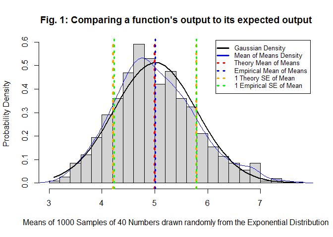

<center><h2>Validating that a program does what you expect</h2></center>

<br>
Author: Russ Robbins

<a href='https://github.com/robbinsr/validating/blob/master/README.md'>Affiliated Code Repository (right click, and open new window or tab)</a>
<br>
<br>
<h4>Executive Summary</h4>
<br>
Statistical theory indicates that sample statistics are unbiased estimators of the population parameters they seek to represent. The R programming language provides a built-in function named rexp(). The purpose of rexp() is to generate values for the theoretical exponential distribution. 

This example shows that the data generated by the R function rexp() indeed, over 40 draws performed 1000 times, does provide data that maps to statistical theory. Therefore, at least in the context shown here, the function rexp() acts as expected. Note that if rexp() acts as expected, rexp() can then be used for simulation experiments that use rexp's outputs.


 
<br>
<h4>Technical Discussion</h4>
<br>
The average mean of the distributions generated by rexp() is centered at 5.0365828. This very similar to what theory purports. Theory, for this lambda, indicated it would be centered at 5. 

The standard error of the mean of the distributions generated by rexp() is 0.7883693.
Theory, for this lambda, indicated it would be 0.7905694. 

Note that the Mean of Means Density distribution (the solid blue line forming a bell shape) that was generated approximates the Gaussian distribution (the solid black line). 

This is what is expected when sample statistics are indeed unbiased estimator. This is the behavior the rexp() function seeks to provide.

<br>
<h4>Steps in Analysis</h4>
<br>
Note that the results (as shown in the figures above) differ from since different simulations were run. The code for for the executive summary is hidden (i.e., echo=FALSE).

1. First I set the parameters to be used with rexp().

```r
a_lambda <- 0.2
a_n=40
a_num_sims=1:1000
a_sample_mean<-1/lambda
a_SD<-1/a_lambda
a_exp_mean_of_means <- a_sample_mean
a_exp_SE_of_means <- SD / sqrt(n)
```

2. Then I checked to see that the function rexp() actually creates different distributions each time.

```r
par(mfrow = c(1,3))

set.seed(1020)
a_rexp_sim1<-rexp(a_n,a_lambda)
a_rexp_mean1<-round(mean(a_rexp_sim1),3)
a_rexp_sd1<-round(sd(a_rexp_sim1),3)
a_xname<-paste("Mean: ", a_rexp_mean1," SD: ", a_rexp_sd1)
hist(x=a_rexp_sim1,xlab=a_xname)

set.seed(3888)
a_rexp_sim2<-rexp(a_n,a_lambda)
a_rexp_mean2<-round(mean(a_rexp_sim2),3)
a_rexp_sd2<-round(sd(a_rexp_sim2),3)
a_xname<-paste("Mean: ", a_rexp_mean2," SD: ", a_rexp_sd2)
hist(x=a_rexp_sim2,xlab=a_xname)

set.seed(4242)
a_rexp_sim3<-rexp(a_n,a_lambda)
a_rexp_mean3<-round(mean(a_rexp_sim3),3)
a_rexp_sd3<-round(sd(a_rexp_sim3),3)
a_xname<-paste("Mean: ", a_rexp_mean3," SD: ", a_rexp_sd3)
hist(x=a_rexp_sim3,xlab=a_xname)
```

3. Then I ran 1000 simulations of samples of 40 randomly drawn exponentials and computed the empirical mean as well as the empircal standard error.

```r
a_rexp_sims<-data.frame(lapply(a_num_sims, function (x) {rexp(a_n,a_lambda)}))
colnames(a_rexp_sims)<-a_num_sims
a_rexp_sims_sample_means<-data.frame(sapply(a_rexp_sims,mean))
colnames(a_rexp_sims_sample_means)<-c("means")
a_emp_mean_of_means<-mean(a_rexp_sims_sample_means[,1])
a_emp_SE_of_means<-sd(a_rexp_sims_sample_means[,1])
a_h<-unlist(a_rexp_sims_sample_means[,1])
```

4. Then I created a table and a histogram to show that the theory and the empirical results actually agreed. Note that this figure is slightly different to that generated above because the analysis was run again in as this **steps in the analysis** section was built. In other words, the rexp behaves randomly each time. Again, this is what it claims to do. More importantly, this kind of behavior would be very helpful when you do simulation studies. You wouldn't want every set of simulations to do the same thing. Instead you would want your simulations to be driven by randomly generated values, so that you could mimic a prospective future, that you do not know yet.


```r
statistics<-c(a_exp_mean_of_means,
              a_emp_mean_of_means,
              a_exp_SE_of_means,
              a_emp_SE_of_means)
  
a_t<-matrix(data=c(a_exp_mean_of_means,
                   a_emp_mean_of_means,a_exp_SE_of_means,a_emp_SE_of_means),
            nrow=2, ncol=2, byrow=TRUE)
a_t<-data.frame(a_t)
colnames(a_t)<-c("Theoretical","Empirical")
rownames(a_t)<-c("Mean","SE")

hist(h,breaks=20,col="light gray",prob=TRUE,main="Fig. 2: Comparing a function's output to its expected output",ylab="Probability Density",xlab="Means of 1000 Samples of 40 Numbers drawn randomly from the Exponential Distribution") 
lines(density(a_h),col="blue")
legend("topright",legend=c("Gaussian Density", "Mean of Means Density", "Theory Mean of Means", "Empirical Mean of Means","1 Theory SE of Mean", "1 Empirical SE of Mean"),lty=c(1,1,3,3,3,3),lwd=c(3,3,3,3,3,3), col=c("black","blue","red", "blue","orange","green"),merge=TRUE,inset=.01,cex=.8,adj=0) 
a_xfit<-seq(min(a_h),max(a_h),length=40) 
    a_yfit<-dnorm(a_xfit,mean=mean(a_h),sd=sd(a_h))
lines(a_xfit, a_yfit, col="black", lwd=2)
abline(v=exp_mean_of_means,col="red", lwd=4, lty=3)
abline(v=emp_mean_of_means,col="blue", lwd=3, lty=3)
abline(v=exp_mean_of_means-exp_SE_of_means,col="orange", lwd=4, lty=3)
abline(v=exp_mean_of_means+exp_SE_of_means,col="orange", lwd=4, lty=3)
abline(v=emp_mean_of_means-emp_SE_of_means,col="green", lwd=3, lty=3)
abline(v=emp_mean_of_means+emp_SE_of_means,col="green", lwd=3, lty=3)
```

 
